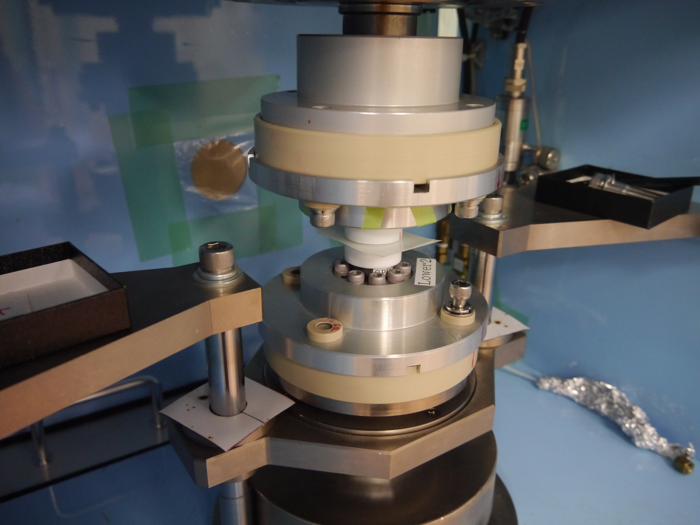

# GP prescale pressure measurement

This directory includes the data and code to evaluate the pressure concentration on the gouge patch. We used the pressure-sensitive film, [prescale, FUJIFILM](https://www.fujifilm.com/jp/ja/business/inspection/measurement-film/prescale), LW range (2.5-10 MPa).

# GP Prescale measurement: GPPS-02
2023.7.2- Kurama Okubo

# Overview

We conducted the measurement of pressure on the gauge patch using the Prescale and the rotary shear machine installed in NIED as the uniaxial compression machine. This document is a note of the series of experiments.

We always follow the continuous pressure for 2 minutes rather than the instantaneous pressure of 5 seconds.

# Experiment IDs

- Room temperature is 24.4 deg C and the relative humidity of the room is 57%. This is the bottom of the zone B. The zone would not change even though there is a subtle variation in the temperature and humidity.

| Experiments ID |  Case ID | Condition | Temp [C] & RH [%] | Note |
| :---: | :---  | :--- | :--- | :--- |
| GPPS_02_001 | - | 2.5MPa | 24.8, 57 | Overscaled |
| GPPS_02_002 | - | 2.5MPa | 24.8, 57| Overscaled; the amount of gouge might be too large. |
| GPPS_02_003 | - |  2.0MPa | 24.8, 57 | Spotty noise occurred outside of the patch |
| GPPS_02_004 | Case 1 | 2.0MPa | 24.8, 57 | Spotty noise occurred outside of the patch
| GPPS_02_005 | Case 2 | 2.0MPa | 24.8, 57 | Looks good |
| GPPS_02_006 | Case 3 | 2.0MPa | 24.8, 57 | Looks good |
| GPPS_02_007 | Case 4 | 2.0MPa | 24.8, 57 | A little of spotty noise, but acceptable |
| GPPS_02_008 | Case 5 | 2.0MPa | 24.8, 57 | Looks good |
| GPPS_02_009 | Case 6 | 2.0MPa | 24.4, 59 | Looks good |
| GPPS_02_010 | - | 2.5MPa | 24.9, 62 | Looks good, but it looks similar with the case of 2.0MPa. This may be due to the variation of the thickness of gouge patch.|
| GPPS_02_011 | Case 7 | 2.0MPa | 24.9, 62 | Looks good |
| GPPS_02_012 | Case 1 | 3.0MPa | 24.9, 62 | using both LW and MW; Looks good |
| GPPS_02_013 | Case 1 | 4.0MPa | 24.9, 62 | using both LW and MW; Looks good |
| GPPS_02_014 | Case 2 | 4.0MPa | 24.9, 62 | using only MW; Looks better than 011 and 012. **We found the overlapping of LW and MW sheets underestimate the pressure in MW.**  |
| GPPS_02_015 | Case 3 | 4.0MPa | 24.8, 60 | only MW; Looks good|
| GPPS_02_016 | Case 4 | 4.0MPa | 24.8, 60 | only MW; Looks good|
| GPPS_02_017 | Case 1 | 2.0MPa | 24.8, 51 | only LW; Looks good; indicating the overlapping does not cause the over/under estimation of LW.|
| GPPS_02_018 | Case 2 | 2.0MPa | 24.8, 51 | only LW; one side contact.|
| GPPS_02_019 | Case 3 | 2.0MPa | 24.8, 51 | only LW; one side contact.|
| GPPS_02_020 | Case 4 | 2.0MPa | 25.0, 52 | only LW; Looks good.|

## Master cases

- For 2.0MPa, **Case 2, 3, 5, 6, 7** are the master cases.
- For 4.0MPa, **Case 2, 3, 4** are the master cases.
- **GPPS_02_017 and GPPS_02_020** can confirm the overlapping does not affect the dyeing of Prescale.

# How to convert the dye color to pressure

We used [prescale mobile](https://www.fujifilm.com/jp/ja/business/inspection/measurement-film/prescale-mobile) to convert the color to pressure value. We used prescale mobile v2.3.7 (2023.07) and took the photo using iPad Pro 11-inch (1st generation) based on the color calibration sheet. 

# Photo of prescale experiments
We scanned the LW sheet using `ApeosPort-VI C3371` (FUJIFILM) to capture the photo of prescale. 