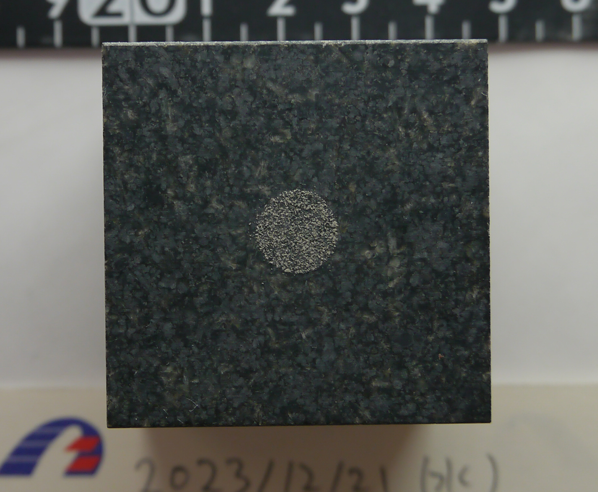

# GP topography scan
We measured the topography of the gouge patch using the laser displacement sensor (LDS, LT-9010M, Keyence, minimum vertical resolution: ~ 10 nm) and moving stage (horizontal resolution = 50 μm). The measurement range is ±200.0 [μm] for ±10V. Run `code/main_QTtoposcan_GP02.m` to plot the topography figure. `Ztopo_data_GPTOPO-02_001.mat` is the 2D topography data converted from the raw continuous data of the LDS compiled processed by `code/main_QTtoposcan_GP02.m`.  

<!-- We also compute the spectrum of heterogeneity by `code/evaluate_spectrum_GP02.m`. -->