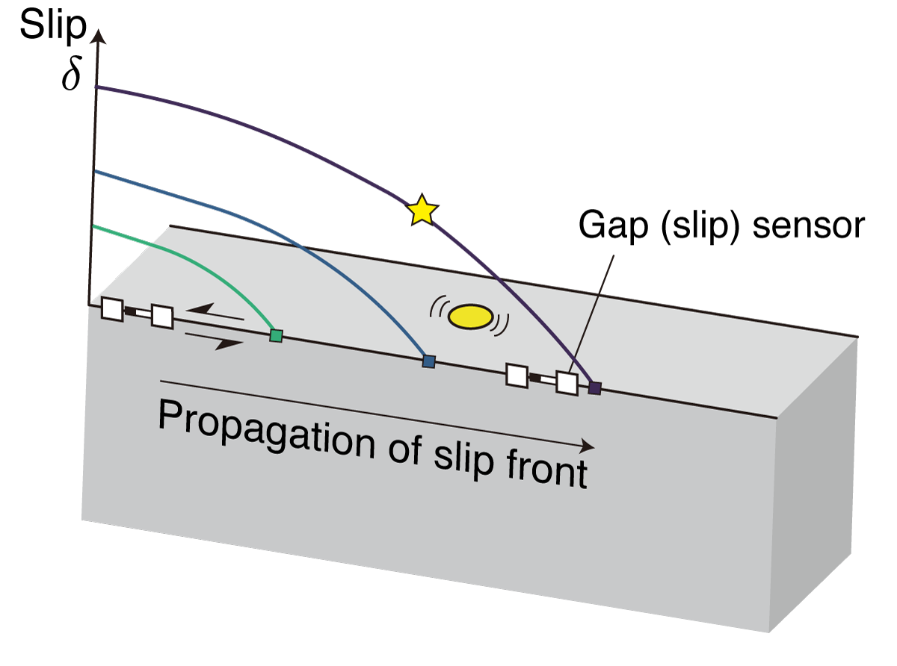

# Gouge event stats

This repogitory contains the analysis of the correlation between the event magnitude and the other quantities of the stick-slip experiments.

We aim to find if the event magnitude, which reflects the magnitude of the coseismic stress drop, is related to some quantities associated with the macroscopic quantities.

## [Mainshocktiming](Mainshocktiming)
We evaluated the onset and the termination of the main stick-slip event from slip and slip velocity from the the slip sensors. This is used to evaluate the hold time analysis.

## [M0_macro_comparisons](M0_macro_comparisons)
We compared the macroscopic quantities with the M0 of gouge events.

1. M0 and mean slip of the stick-slip events
2. M0 and macroscopic stress drop
3. M0 and shear stress before the onset of main shock
4. M0 and hold time

Note that we could not find any clear correlations for these case studies.

## [M0_LocalSlip_and_SlipVel](M0_LocalSlip_and_SlipVel)
We compared the local slip cumulation, which is equivalent to the slip deficit, and the slip velocity with the M0. We computed the linear interpolation of the gap sensors near the gouge patch to evaluate the cumulative slip at the onset of the gouge patch events.

### Process flow:
1. Compute the slip velocity. We applied the 4th order two-way low-pass filter on the slip time history to remove the noise, and computed the derivative to obtain the slip velocity.

2. Compute the local cumulative slip and slip velocity by the linear interpolation.

3. Plot the seismic moment and local slip, and slip velocity. We replot the master figure with ipython notebook.

4. Plot the profile of the slip, slip velocity and the gouge event timing.

5. We plot the comparison of the slip/slipvelocity and the seismic moment `05_localslip_slipvel_masterplot.ipynb` as master plots.

